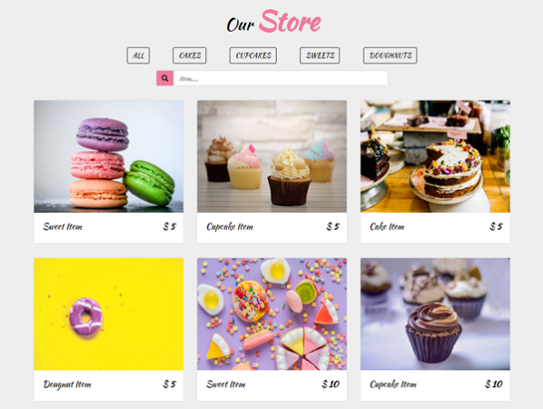

Requirements for the project
- Create the layout by fetching the data from the JSON server.(Layout design is below)
- We need tabs that is basically used to filter cakes based on type.(The type field is available inside JSON data for each of the cakes).
- There will be a extra tab for 'All', so when clicked on this tab, you need to display all the cake data.
- Otherwise if clicked on any other tab, just display cakes for that type.
- There is also a search box that will help us to filter cakes based on the cake name. If all tab is selected you will filter from whole JSON data, but if a particular tab is selected allow filtering only based on that type.

Design Reference

JSON server link
- https://api.npoint.io/606c518ded6941e836e8